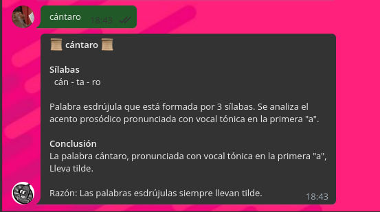
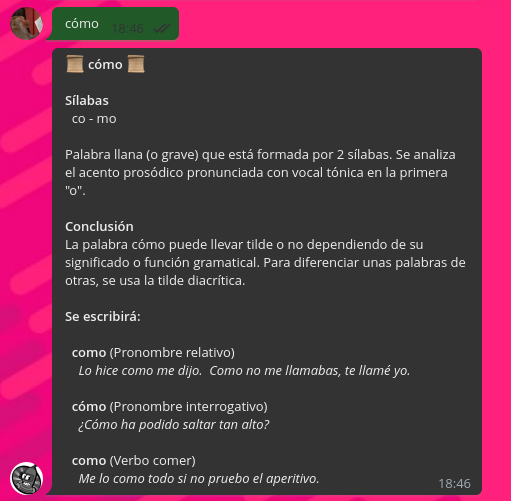
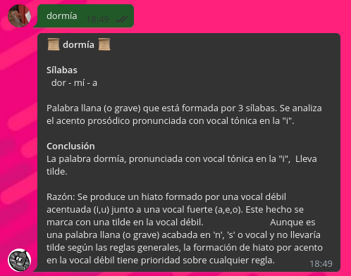

# LlevaTildeBot

## Uso de `@lleva_tilde_bot`

Envía una palabra con una tilde donde dudes que debería ir.

Por ejemplo:
  - _línea_
  - _esdrújula_
  - _monuménto_ (no lleva tilde)
  - _cása_ (no lleva tilde)
  - _cláramente_ (no lleva tilde)

Como se puede ver, aunque la palabra no lleve tilde es obligatorio poner una tilde para hacer el análisis sobre esa sílaba.

El bot contestará con un análisis de la palabra y algunos ejemplos en caso de tildes diacríticas.

Ejemplos:

